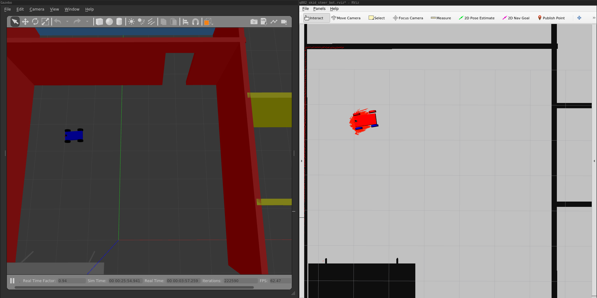

### WhereInQ802



#### Overview

Where am I in Q802: Adaptive Monte Carlo Localization in ROS 1-noetic

#### Setup

```
aptitude update
aptitude install ros-noetic-navigation
aptitude install ros-noetic-map-server
aptitude install ros-noetic-move-base
aptitude install ros-noetic-amcl
```

#### Installation

Symlink `where_in_q802` to your catkin workspace.  For example:

```
ln -s where_in_q802 path/to/your/catkin_ws/src/where_in_q802

cd path/to/your/catkin_ws/
catkin_make
source devel/setup.bash

# Quick test
cd src
roslaunch where_in_q802 world.launch
```

#### Making a map of the Q802 world

I leveraged the [pgm_map_creator](https://github.com/udacity/pgm_map_creator) from Udacity.  
It requires boost.gil and a hacked version of `pgm_map_creator` (for ros-noetic).  Details:

[boost-gil 1.65](https://github.com/boostorg/gil/releases/tag/boost-1.65.0)
```
wget https://github.com/boostorg/gil/archive/boost-1.65.0.tar.gz
gunzip boost-1.65.0.tar.gz
tar -xvf boost-1.65.tar
cd gil-boost-1.65.0/include
sudo cp -r boost /usr/local/include

# Patch up gil a tiny bit:
vim extension/io/png_io_private.hpp
and add `#define int_p_NULL (int*)NULL`
```

pgm-map-creator
```
cd path/to/your/catkin_ws/src/
git clone https://github.com/udacity/pgm_map_creator.git
```

`pgm_map_creator` requires changes per the patch file to allow it
to work with ros-noetic.  See `pgm_map_creator.patch`

Add and edit your world file
```
cd path/to/your/catkin_ws
catkin_make

# copy your world file
cp <YOUR GAZEBO WORLD FILE> src/pgm_map_creator/world/<YOUR GAZEBO WORLD FILE>

# Insert the map creator plugin to your map file. 
# Open the map file using the editor of your choice. 
# Add the following tag towards the end of the file, 
# but just before </world> tag
<plugin filename="libcollision_map_creator.so" name="collision_map_creator"/>
```

Making the map pgm file!
```
# run gzserver
gzserver src/pgm_map_creator/world/<YOUR GAZEBO WORLD FILE>

# in an a second byobu/screen/terminal:
roslaunch pgm_map_creator request_publisher.launch

# adjust the size of the map as needed by editing the x, y values of
# `launch/request_publisher.launch`
```

Add the map to your package
```
cd path/to/your/catkin_ws/
cp src/pgm_map_creator/maps/<YOUR MAP NAME>  src/<YOUR PACKAGE NAME>/maps/<YOUR MAP NAME>

# Also provide a yaml file for the map:
# http://wiki.ros.org/map_server#YAML_format
```

#### Adaptive Monte Carlo Localization: Launch
```
# term 1: the world, gazebo, rviz
roslaunch where_in_q802 world.launch

# term 2: map-server, amcl, move_base nodes
roslaunch where_in_q802 amcl.launch
```

#### Teleop Package

If you prefer to control your robot to help it localize itself, add the teleop
node to your package.
```
git clone https://github.com/ros-teleop/teleop_twist_keyboard
catkin_make
source devel/setup.bash
rosrun teleop_twist_keyboard teleop_twist_keyboard.py
```

#### Further Reading
- [AMCL in ROS1](http://wiki.ros.org/amcl)
- [A Particle Filter Tutorial for Mobile Robot Localization](http://www.cim.mcgill.ca/~yiannis/particletutorial.pdf)
- [Particle Filter in Robotics, Thrun](https://dl.acm.org/doi/pdf/10.5555/2073876.2073937)
- [Monte Carlo Localization, wiki](https://en.wikipedia.org/wiki/Monte_Carlo_localization)
- [Kalman Filter, 1](http://www.bzarg.com/p/how-a-kalman-filter-works-in-pictures/)
- [Kalman Filter, 2](http://robotsforroboticists.com/kalman-filtering/)
